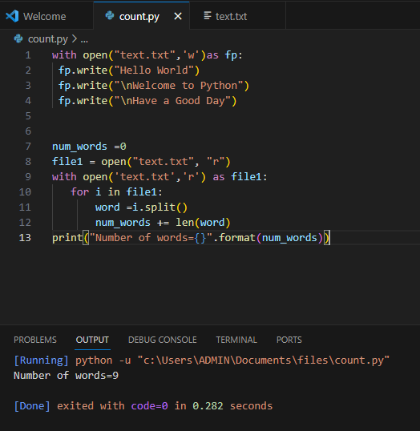

# Word-count

## AIM:
To write a python program for getting the word count from a text.
## EQUIPEMENT'S REQUIRED: 
PC
Anaconda - Python 3.7
## ALGORITHM:

### Step 1:

Declare number of words is 0

### Step 2:
open it with txt file

### Step 3:
Give range for i

### Step 4:
Then nxt split the words

### Step 5:
count the number of words

### Step 6:
Giving print statement for getting output

 
 ## PROGRAM:
 ```
 
Develpoed By: Iswarya.P
RegisterNumber:23013459

 with open("text.txt",'w')as fp:
  fp.write("Hello World")
  fp.write("\nWelcome to Python")
  fp.write("\nHave a Good Day")


num_words =0
file1 = open("text.txt", "r")
with open('text.txt','r') as file1:
    for i in file1:
        word =i.split()
        num_words += len(word)
print("Number of words={}".format(num_words))
```


### OUTPUT:

 
 


## RESULT:
Thus the program is written to find the word count from a text.
